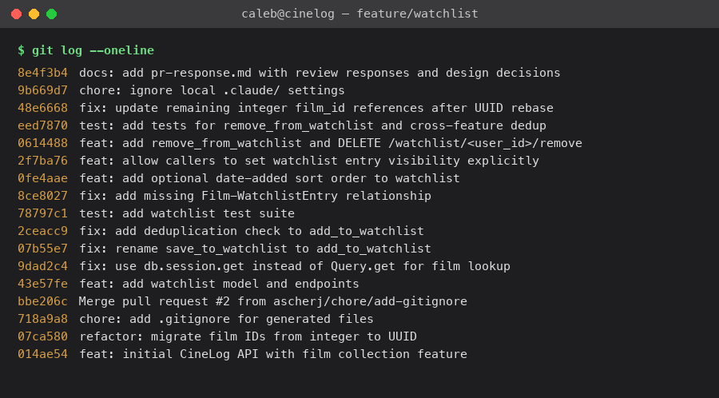

# PR Response Doc — CineLog Watchlist Feature

## AI Usage
I used Claude Code throughout this project, in three distinct ways:

1. **Orientation.** Before touching any review comment, I had it read `models.py`, `services/collection_service.py`, and `tests/test_collection.py` in full and summarize the naming convention, the dedup pattern in `add_to_collection()`, and the fixture structure in the test file. That's what let Comments 1–3 get resolved by direct pattern-matching against existing code rather than guessing at a style.
2. **Rebase hygiene and verification.** For Comment 6, after the automatic `git rebase origin/main` reported no conflicts, I had it re-read the full `models.py` rather than trust the "Applying: ..." success output — that re-read is what caught the silently-dropped `WatchlistEntry` class (see Comment 6 above for the full mechanism). It also ran the full test suite, a manual `curl` smoke test against a running instance, and grep sweeps for leftover integer-ID references after every rebase step, rather than declaring the rebase done as soon as git stopped complaining.
3. **Commit hygiene.** At the end, it reviewed `git log --oneline` against the Conventional Commits spec and caught one commit (`feat: add watchlist model and endpoints`) that bundled an unrelated one-line fix to `collection_service.py`'s film lookup (`Query.get()` → `db.session.get()`) — that got split into its own `fix:` commit so each commit represents one logical change.

For Comments 4 and 5 (the design decisions), I did not ask AI to generate the position or the argument — the reasoning below is grounded in specifics I found by reading this codebase (e.g., that `public` is enforced nowhere yet, that `routes/films.py` sorts alphabetically and `get_collection()` sorts by date, that a watchlist grows unbounded while a collection doesn't). I did use it as a devil's advocate after drafting: for Comment 4, I asked what a reviewer would say a public-by-default watchlist costs users, which sharpened the "tradeoff acknowledged" paragraph (specifically the point about watchlist entries revealing *current* intent rather than a completed action, which I hadn't stated as clearly in my first draft). For Comment 5, I asked what's wrong with treating collection and watchlist sort order as "should obviously match for consistency," which pushed me to make the collection-vs-watchlist "diary vs. to-do list" distinction explicit instead of just asserting it.

## Comment 1 — Rename
**What I did:** Renamed `save_to_watchlist()` to `add_to_watchlist()` in `services/watchlist_service.py`, matching the project's `verb_to_noun` convention already used by `add_to_collection()` / `remove_from_collection()` / `get_collection()`.

**How I verified:** Ran a project-wide `grep -rn "save_to_watchlist"` (excluding `.venv`) before and after the change. Before: 3 hits — the definition in `services/watchlist_service.py` and two references in `routes/watchlist/watchlist.py` (the import and the call in `add_film`). After the rename and updating both call sites: 0 hits remain. Full test suite still passes (4/4 at that point, before the new watchlist tests existed).

## Comment 2 — Deduplication
**What I did:** Added an `AlreadyOnWatchlistError` exception and a check-then-raise guard in `add_to_watchlist()`, directly mirroring `add_to_collection()` in `services/collection_service.py`: query for an existing `WatchlistEntry` by `(user_id, film_id)` with `.filter_by(...).first()` before creating a new row, and raise if one exists instead of silently inserting a duplicate. I also updated `routes/watchlist/watchlist.py` to catch both `FilmNotFoundError` (404) and `AlreadyOnWatchlistError` (409) around the `add_to_watchlist()` call — the route previously had no exception handling at all, and `routes/collection.py` already established the same 404/409 pattern for the equivalent collection errors, so I extended the watchlist route to match rather than leave it inconsistent.

Note: unlike `CollectionEntry`, `WatchlistEntry` doesn't have a `UniqueConstraint("user_id", "film_id")` at the DB level. I chose to add the same application-level check `add_to_collection()` uses rather than also add a DB constraint, to keep this commit scoped to the reviewer's ask and consistent with the existing service; a DB-level constraint would be a reasonable follow-up but is a separate concern (schema migration) from the service-level fix requested here.

**How I verified:** Wrote a throwaway manual script (in-memory SQLite, not committed) that added the same film twice and confirmed `AlreadyOnWatchlistError` was raised on the second call and only one row existed in the table; also confirmed a nonexistent `film_id` still raises `FilmNotFoundError` through the same code path. Later formalized the duplicate case as `test_add_to_watchlist_duplicate_raises` in Comment 3's test file. Full suite passed throughout.

## Comment 3 — Missing test
**What I did:** Created `tests/test_watchlist.py`, using `test_collection.py` as the template: same `app`/`sample_user`/`sample_film` fixtures (in-memory SQLite, isolated per test), same naming style. Per `CONTRIBUTING.md`'s testing checklist for new service functions ("happy path, duplicate/conflict, nonexistent ID"), I wrote all three: `test_add_to_watchlist_creates_entry`, `test_add_to_watchlist_duplicate_raises`, and the specifically requested `test_add_to_watchlist_nonexistent_film_raises` — modeled directly on `test_add_to_collection_nonexistent_film_raises`, asserting `FilmNotFoundError` is raised for a film_id that doesn't exist rather than a raw DB integrity error.

**How I verified:** `pytest tests/test_watchlist.py -v` — 3/3 passed. Then `pytest tests/ -v` for the full suite — 7/7 passed.

## Comment 4 — Default visibility
**My position:** Keep `public=True` as the default, but make it an explicit, overridable parameter rather than an implicit column default (implemented in `add_to_watchlist(user_id, film_id, public=True)` and `POST /watchlist/<user_id>/add`).

**Reasoning:** I looked for precedent elsewhere in the codebase before deciding, and found two relevant data points. First, `public` is a completely new concept — `CollectionEntry` has no visibility field at all, meaning the rest of the app currently treats a user's logged activity (what they've watched and rated) as implicitly shared, not private. A watchlist defaulting to public is consistent with that existing stance, and consistent with the README's own framing of CineLog as "a community film tracking app" — the product's value is built around users seeing each other's activity, and a private-by-default watchlist would quietly opt every new entry out of that unless a caller explicitly asked otherwise. Second, I checked whether `public` is actually enforced anywhere right now: it isn't. `view_watchlist()` returns all of a user's entries regardless of the flag, and there is no endpoint anywhere in the app that lets one user browse another user's watchlist at all yet. So today, the default carries no real exposure risk — it's forward-looking metadata for a feature (viewing other users' lists) that doesn't exist yet. Given that, optimizing the default for "the common case needs no extra step" (users who want to participate in the community aspect don't have to think about a setting) is defensible now, while the door stays open to add stronger defaults later once an actual public-viewing endpoint ships.

**Tradeoff acknowledged:** A watchlist is arguably more sensitive than a collection: a collection entry records something you've *already done* (watched and rated a film — a completed, low-stakes fact), while a watchlist entry can reveal current interest or intent before you're ready to share it (e.g., someone doesn't want their partner to see a film queued up before a surprise, or doesn't want their taste in half-finished, impulsively-added titles judged the way a curated "watched" list might be). Users also add to a watchlist more casually/quickly than they log a completed watch, so they're less likely to pause and consider exposure at the moment of adding. That's a real cost of defaulting to public, and it's the main reason I implemented `public` as an explicit, easily-overridable parameter rather than leaving it as a bare column default the caller has to know to override by hand — the API surface now makes "opt out of visibility" a first-class, one-line choice instead of something a client has to discover by reading the model.

## Comment 5 — Sort order
**My position:** I'm keeping the default alphabetical-by-title (not switching to date-added), but I added `get_watchlist(user_id, sort="date_added")` and `GET /watchlist/<user_id>?sort=date_added` so the ordering you and Dani-risingBW want is fully available — just not as the silent default.

**Reasoning:** Before picking a side, I checked how the rest of the app already sorts lists of films, and found a precedent I think is directly relevant: `routes/films.py`'s `list_films()` also sorts `.order_by(Film.title)` — alphabetical by title. That's the existing convention for *browsing a set of films* in this codebase. `get_collection()`, by contrast, sorts by `date_added` descending — but a collection is functionally a diary/activity log of films a user has already watched, which is a different task from browsing: you read a diary chronologically, but you scan a list of things to consider. A watchlist is structurally closer to "browse films" than to "activity log" — it's a list you consult to decide what to watch next, and titles are what you actually search by ("did I already add Inception?"), not add-dates. So I don't think the two features being sorted differently is really an inconsistency; I think it's each following the precedent that already fits its own use case, and the collection/watchlist comparison is a bit of a false parallel.

**Engagement with reviewer's point:** Your point — "most users want to see what they added recently" — and Dani's — wanting to find the oldest entry to finally cross it off, or the newest to see what just got added — are both real, concrete needs, and I don't think either of you is wrong that date-added ordering serves them well. Where I land differently is on whether that should be the *silent default* everyone gets versus an *available option*: as a watchlist grows (which, unlike a collection, it's designed to do — items only leave via `remove_from_watchlist` when you've actually watched them or changed your mind), alphabetical order is what keeps it scannable by name, while chronological order actively degrades scannability over time since new adds keep reshuffling the list and nothing stays put to anchor a mental map of "where's X." Rather than pick one default that serves one need better than the other, I implemented both: alphabetical stays the default (matching the films-browsing precedent), and `?sort=date_added` gives you and Dani the exact ordering described, on demand, the same way `films.py` already exposes `?genre=`/`?year=` as optional query params on top of a sensible default. If usage data later shows most people always flip to date-added, that's a good, evidence-based reason to swap the default — I just don't think we have that evidence yet, and I'd rather not guess in either direction.

## Comment 6 — Rebase
**What conflicted:** Before rebasing I cleaned up my own commits with `git rebase -i` (squashing the two messy original commits into one `feat: add watchlist model and endpoints`, and dropping a redundant `.gitignore` commit that main had already picked up independently), so the actual `git rebase origin/main` only had to replay 9 clean commits.

`git rebase origin/main` reported only one textual conflict, in `.gitignore` (an add/add conflict — both branches added the file independently; trivial, resolved by keeping both and later adding one line for `.claude/`). No conflict was reported anywhere in `models.py`, `services/watchlist_service.py`, or `routes/watchlist/watchlist.py` — but that turned out to be misleading, not reassuring.

The real conflict was structural, not textual, and git's patch-based rebase couldn't detect it: this repo's very first commit already contained the full pre-refactor `models.py` (including the `WatchlistEntry` class), so none of my commits' diffs actually contained a line that "adds" `WatchlistEntry` — from git's point of view, that class was just already there. `origin/main`, on the other hand, never had `WatchlistEntry` at all (the watchlist feature was never merged into main), and its `Film.id`/`CollectionEntry.film_id` were migrated from `Integer` to `String(36)` (UUID). When my commits replayed cleanly on top of `origin/main`'s tree, the `WatchlistEntry` class was silently absent afterward — every one of my commits applied "successfully" with no CONFLICT marker, but the resulting `models.py` was missing an entire class. I caught this only by not trusting the clean "Applying: ..." output and manually re-reading `models.py` in full after the rebase — `test_watchlist.py` immediately failed on `ImportError: cannot import name 'WatchlistEntry'`, confirming it.

**How I resolved it:** I used `git rebase -i origin/main` with `edit` on the first replayed commit (`feat: add watchlist model and endpoints`) and reintroduced the `WatchlistEntry` model there, this time with `film_id = db.Column(db.String(36), db.ForeignKey("film.id"), nullable=False)` to match the now-UUID `Film.id`, keeping everything else (fields, `to_dict()`) identical to the original. Continuing the rebase from there produced one genuine, expected textual conflict — a docstring line in `services/watchlist_service.py` and `routes/watchlist/watchlist.py` that I had already updated to say `"<uuid>"` while a later commit's patch also touched the same line to add the `public` param — resolved by combining both edits (`Body: { "film_id": "<uuid>", "public": <bool> }`). After the rebase finished, I swept the rest of the codebase for leftover integer-ID assumptions the rebase never flagged because they weren't part of any conflicting hunk: `remove_from_watchlist()`'s docstring, the `DELETE` route's body example, and a test that used a bare integer (`999999`) as a fake nonexistent `film_id` — updated to a fake UUID string (`"00000000-0000-0000-0000-000000000000"`), matching `test_collection.py`'s existing pattern.

**How I verified no conflict remains:** `grep -rn` for `<<<<<<<`/`=======`/`>>>>>>>` across the repo came back empty. `grep -rn "999999\|film_id.*int\|integer"` across all `.py` files found nothing left except the two historical comments in `models.py` describing the actual refactor commit (which are correct, not stale). Full suite: `pytest tests/ -v` — 13/13 passed, including the watchlist tests that exercise real SQLAlchemy foreign-key joins against the UUID `Film` table, which would fail immediately if the FK types didn't line up. I also started the app against a scratch SQLite DB and drove the real HTTP endpoints with `curl` (add, duplicate → 409, private-flag add, `?sort=date_added`, remove, remove-again → 404) to confirm the UUID-based flow works end-to-end outside of pytest, not just inside test fixtures. Finally, `git log --oneline --merges origin/main..HEAD` returned nothing, confirming no merge commits, and `git status` is clean.

## PR Description

### What this adds

A watchlist feature for CineLog: users can save films they want to watch later, view that list, and remove films from it once they've watched them or changed their mind.

- `POST /watchlist/<user_id>/add` — add a film to a user's watchlist. Body: `{ "film_id": "<uuid>", "public": <bool> }` (`public` optional, defaults to `true`). Returns 201 on success, 404 if the film doesn't exist, 409 if it's already on the watchlist.
- `GET /watchlist/<user_id>` — return a user's watchlist, alphabetical by title by default. Supports `?sort=date_added` to order by most recently added first instead.
- `DELETE /watchlist/<user_id>/remove` — remove a film from a user's watchlist. Body: `{ "film_id": "<uuid>" }`. Returns 200 on success, 404 if the film isn't on the watchlist.

### Design decisions

- **Default visibility (`public=True`)** — kept `public` defaulting to `True`, consistent with the rest of the app (collection entries have no privacy concept at all) and CineLog's framing as a community app, while making `public` an explicit, overridable parameter on `add_to_watchlist()` / the add endpoint rather than a bare column default. Full reasoning and the acknowledged tradeoff (a watchlist can reveal current intent more than a completed "watched" entry) are in Comment 4 above.
- **Sort order (alphabetical default, not date-added)** — kept `get_watchlist()`'s default alphabetical-by-title, matching how `routes/films.py` already browses films, rather than switching to date-added as requested. Instead of picking one default that only serves one need, added `?sort=date_added` as an explicit option so the reviewer's and Dani-risingBW's use case (finding the oldest/newest entry) is fully supported without sacrificing scannability-by-name as the list grows. Full reasoning and engagement with the reviewer's point are in Comment 5 above.

### How to manually test

```bash
python -m venv .venv && source .venv/bin/activate
pip install -r requirements.txt
python app.py   # runs on http://127.0.0.1:5000
```

The app has no seed script and no user/film creation endpoint (films are meant to be pre-seeded, per `routes/films.py`'s docstring), so create a test user and two films directly against the same database before hitting the API:

```bash
python - <<'EOF'
from app import create_app, db
from models import User, Film

app = create_app()
with app.app_context():
    u = User(username="tester", email="tester@example.com")
    f1 = Film(title="Alien", year=1979, genre="Horror")
    f2 = Film(title="Zodiac", year=2007, genre="Thriller")
    db.session.add_all([u, f1, f2])
    db.session.commit()
    print("user_id:", u.id)
    print("film1_id:", f1.id)
    print("film2_id:", f2.id)
EOF
```

Use the printed UUIDs below in place of `<user_id>`, `<film_uuid>`, and `<other_film_uuid>`:

```bash
# Add a film to the watchlist (public by default)
curl -X POST http://127.0.0.1:5000/watchlist/<user_id>/add \
  -H "Content-Type: application/json" \
  -d '{"film_id": "<film_uuid>"}'

# Add a second film as private
curl -X POST http://127.0.0.1:5000/watchlist/<user_id>/add \
  -H "Content-Type: application/json" \
  -d '{"film_id": "<other_film_uuid>", "public": false}'

# Adding the same film twice returns 409
curl -X POST http://127.0.0.1:5000/watchlist/<user_id>/add \
  -H "Content-Type: application/json" \
  -d '{"film_id": "<film_uuid>"}'

# View the watchlist, alphabetical by default
curl http://127.0.0.1:5000/watchlist/<user_id>

# View it sorted by most-recently-added
curl "http://127.0.0.1:5000/watchlist/<user_id>?sort=date_added"

# Remove a film; removing it again returns 404
curl -X DELETE http://127.0.0.1:5000/watchlist/<user_id>/remove \
  -H "Content-Type: application/json" \
  -d '{"film_id": "<film_uuid>"}'
```

Or just run the automated suite, which exercises all of the above against a real in-memory database:

```bash
pytest tests/ -v
```

### Screenshot: cleaned commit history

`git log --oneline` on `feature/watchlist` (relative to `main`), after rebasing and rewriting history — no merge commits:


